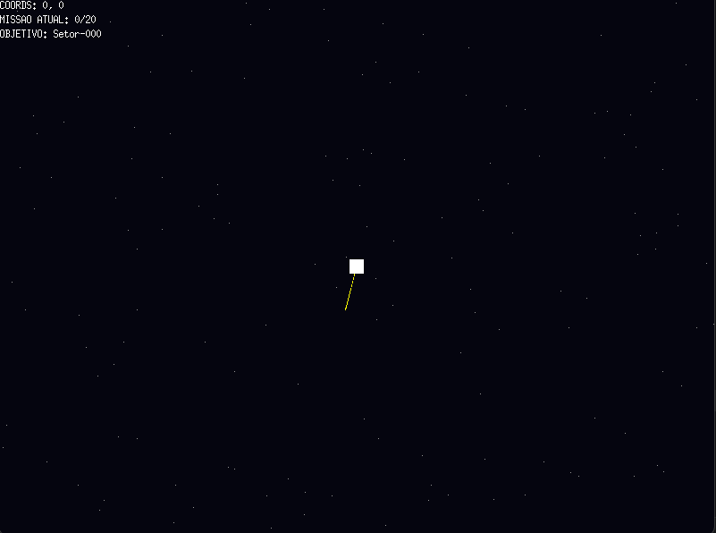

# 🚀 Space Run - Open World Space Explorer

<p align="center">
  
</p>

Um jogo de exploração espacial em mundo aberto desenvolvido em **Go (Golang)** utilizando o motor gráfico **Ebitengine**. O projeto desafia o jogador a navegar por um universo vasto, cumprindo missões de exploração em diversos setores espaciais.

## 🌌 Sobre o Projeto

Este jogo foi criado para explorar conceitos de matemática aplicada a jogos, como conversão de coordenadas globais para tela (Viewport), geração procedural de cenários e sistemas de navegação baseados em vetores.

### 🛠️ Funcionalidades Principais
- **Mundo Aberto:** Navegação fluida em um mapa sem limites fixos.
- **150 Setores Procedurais:** O universo conta com 150 destinos gerados automaticamente com nomes únicos.
- **Sistema de 20 Missões:** Um radar dinâmico aponta para o próximo objetivo, guiando o jogador através da galáxia.
- **Efeito Parallax:** Fundo estelar com múltiplas camadas para criar uma percepção de profundidade espacial.
- **Interface (HUD):** Exibição em tempo real de coordenadas, missão atual e nome do setor alvo.

## 🚀 Tecnologias Utilizadas
- **Linguagem:** Go (Golang) 1.20+
- **Motor Gráfico:** [Ebitengine](https://ebitengine.org/)
- **Matemática:** Trigonometria para o sistema de radar (Atan2).

## 🎮 Como Jogar

1. **Pré-requisitos:** Ter o Go instalado no seu computador.
2. **Instalação:**
   ```bash
   git clone [https://github.com/jplgoncalves/space_run.git](https://github.com/jplgoncalves/space_run.git)
   cd space_run
   go mod tidy
